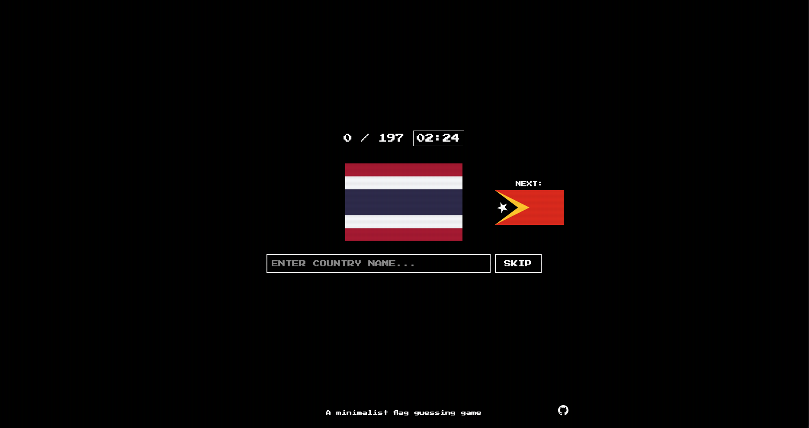

# RetroFlags 🚩

A retro-style flag guessing game with a nostalgic CRT screen aesthetic. Test your knowledge of world flags while racing against the clock!



## 🎮 Play Now

You can play RetroFlags by:
1. Visiting [RetroFlags Online](https://retroflags.vercel.app/) (if hosted)
2. Or by following the setup instructions below to run it locally

## 📋 Features

- **197 Country Flags**: Test your knowledge of all recognized sovereign states
- **Retro Interface**: Enjoy a nostalgic, old-school computer aesthetic
- **CRT Effect**: Complete with scan lines and subtle screen flicker
- **Time Challenge**: Race against the clock to identify as many flags as you can
- **Next Preview**: See a preview of the upcoming flag to keep the pace going
- **Alternative Names**: Multiple accepted names for certain countries

## 🚀 Getting Started

### Prerequisites

- A modern web browser
- Basic knowledge of HTML/CSS/JavaScript (for development only)

### Installation

1. Clone the repository:
   ```
   git clone https://github.com/philniko/retroflags.git
   ```

2. Navigate to the project directory:
   ```
   cd retroflags
   ```

3. Open the `index.html` file in your browser:
   - Double-click the file
   - Or use a local development server

## 🎯 How to Play

1. A flag will appear on the screen
2. Type the name of the country and press Enter
3. If correct, you'll immediately move to the next flag
4. If you're stuck, click the "SKIP" button to move to the next flag
5. Try to identify all 197 country flags as quickly as possible!

### Game Controls

- **Text Input**: Type the name of the country
- **SKIP Button**: Skip the current flag if you're stuck
- **Score Counter**: Tracks your progress (correct/total)
- **Timer**: Shows how long you've been playing

## 🧠 Tips for Playing

- The game accepts alternative names for some countries:
  - "USA" or "America" for "United States"
  - "UK" or "Britain" for "United Kingdom"
  - And many more!
- Look for distinctive elements in each flag to make quick identifications
- The preview of the next flag helps you prepare your answer

## 🛠️ Technical Details

RetroFlags is built with vanilla JavaScript, HTML, and CSS. It uses:

- **FlagCDN API**: For serving flag images
- **RetroComputer Font**: For the authentic retro look and feel
- **Custom CRT Effect**: Created with CSS overlays and filters

## 🧪 Development

### Project Structure

```
retroflags/
├── src/
│   ├── index.html     # Main HTML structure
│   ├── styles.css     # Styling and CRT effects
│   ├── app.js         # Game logic
│   └── countries.js   # Country data with ISO codes
├── README.md          # This file
└── LICENSE            # License information
```

### Adding More Countries or Alternate Names

To add more countries or alternate names:

1. Edit the `countries.js` file to add new countries
2. Modify the `getAlternateNames` function in `app.js` to add more alternate names

## 📄 License

This project is licensed under the MIT License - see the LICENSE file for details.

## 🙏 Acknowledgments

- Flag images provided by [FlagCDN](https://flagcdn.com)
- Retro computer font from Google Fonts
- Inspired by classic educational computer games

## 🤝 Contributing

Contributions are welcome! Feel free to open issues or submit pull requests.

1. Fork the repository
2. Create your feature branch (`git checkout -b feature/amazing-feature`)
3. Commit your changes (`git commit -m 'Add some amazing feature'`)
4. Push to the branch (`git push origin feature/amazing-feature`)
5. Open a Pull Request

---

Created with ❤️ by [philniko](https://github.com/philniko)
